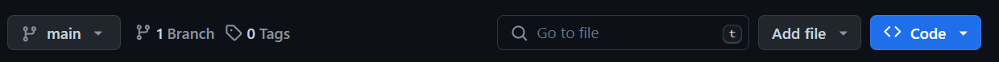

# DashWorkshop

This repository stores the materials for a workshop on visualization of multimodal data, given at LOT Winter School (January 11, 2024, in Tilburg).

<b>It contains 

1. README file
2. Slides
3. Showcase app w/ data (not public)
4. Template for dash app
5. Practice data from SAGA dataset, used from https://github.com/WimPouw/envisionBOX_modulesSAGA/ </b>

It also includes requirements.txt to install all necessary packages.

## Get ready

To be able to follow the workshop and explore the coding procedure of building a dashboard, one needs to have a Python available.

To get Python, you can for example download Anaconda, a common platform for this programming language.

Anaconda: https://www.anaconda.com/download

If you feel you need a guidance, you can follow one of many tutorials online. For instance:
<ul><li>https://www.youtube.com/watch?v=YJC6ldI3hWk (for Mac)</li>
<li>https://www.youtube.com/watch?v=UTqOXwAi1pE (for Windows)</li></ul>

To be able to work with Python scripts, it is very convenient to have a text editor. Essentialy, this can be any software that can edit texts, I personally recommend <b><a href="https://code.visualstudio.com/">Visual Studio Code</a></b>. Once you have it installed, you also need a Python extension in order to run code in VS Code. 
You can follow, for instance, this manual: https://www.datacamp.com/tutorial/setting-up-vscode-python

## Download the repository

Once you are all set up, at the top of this page, click on <b><> Code</b> and then <b>Download ZIP</b>. This will download the repository we will work with during the workshop. 

## Install necessary packages

Last but not least, you will need some extra packages. Now turn on your Anaconda Prompt and type

    cd C:/Directory/where_the_downloaded/folder_lives

and then

    pip install -r requirements.txt

Now everything should install automatically and you are ready to start some coding :)

